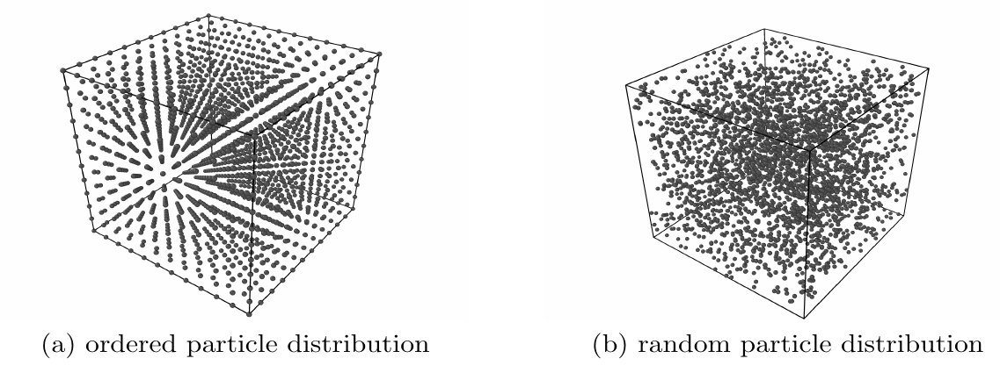

# What is simmsus?

**SIMMSUS** is a research code, initially written in **FORTRAN** that simulates the motion of a system of interacting particles. These particles can be simulated in different scenarios and may interact through different physical mechanisms. The code was initially developed for studying the physics of magnetic spherical particles in suspensions in order to better understand the properties of magnetic fluids (ferrofluids).

## History of the project

The code was initially developed for studying the physics of magnetic spherical particles in suspensions in order to better understand the properties of magnetic fluids (ferrofluids). Since the beggining of the development, the code was designed to consider the effects of Brownian motion, long range dipole-dipole and hydrodynamic interactions. The first physics simulated through **SIMMSUS** was the study of the alignment of the particles in the direction of an applied steady-state magnetic field to see wether the code was capable of capturing the behavior of the equilibrium magnetization predicted by theoretical asymptotic models available on the literature [1].

The comparison between the predictions of **SIMMSUS** and the asymptotic models served as a first validation of the numerical code. After this initial validation, we have implemented several additional features on the code and have used **SIMMSUS** to explore different physical situations regarding the behavior of magnetic fluids. Many of the studies conducted through **SIMMSUS** have been published in prestigious academic Journals, such as *Physics of Fluids* [2,3], *Journal of Magnetism and Magnetic Materials* [4,5,6], *Powder Technology* [7,8] and *Mechanics Research Communications* [9,10].

In its present version **SIMMSUS** is capable of simulating Brownian and non-Brownian suspensions and the user can turn on/off specific physical mechanisms in order to build a customized scenario. For example the user can mix magnetic particles with non-magnetic particles, turn on/off the gravitational field, apply an oscillatory or steady-state magnetic field over the particles, apply a simple or oscillatory shear over the particles, simulate different initial configurations (ordered, random or spherical distributions), simulate mono or polydisperse particles (with the same radius or with different radius) and the list goes on.

Regarding the application of time-dependent magnetic fields, we have conducted a rigorous study on the dynamical susceptibility response of ferrofluids using **SIMMSUS** and have validated the dynamical solution of the rotational motion of the dipole moments of the particles provided by the code by comparing the numerical solution with an asymptotic theoretical model [11]. The code seems to predict with excellent precision the dynamical behavior of the internal structure of ferrofluids.

# General structure of the source-code

The code contains 8 files, from which 7 are necessary to produce the executable file (program) after the compilation and 1 is a configuration file.
These are the following files:

- **simmsus.f90**
- **input.f90**
- **main.f90**
- **subroutines.f90**
- **statistics.f90**
- **variables.f90**
- **makefile**

In order to compile the source-code you must open a Linux terminal and run the make command. For the first time you should run the make command twice. In the first time the compiler will produce the modules from the files **variables.f90** and **subroutines.f90** and the second run will use these recently created modules to produce the executable file **simmsus.ex**.

Since the origins of its earlier development, SIMMSUS has been tested and compiled exclusively on Linux using the Intel Fortran Compiler and up to this version of the manual we have no idea if it compiles or runs using other compilers or operational systems.

In order to run a simulation, the user will need only 2 files: the executable file (**simmsus.ex**) and the input configuration file **simconfig.dat**. The user can drag these two files to a new folder to run a new set of numerical simulations defined on the configuration file **simconfig.dat**. 

The configuration file is a text file with several questions that the user should answer in order to direct the path that **SIMMSUS** should cross in order to produce a specific set of simulations for the intended physics. We will talk about this file later. Figure bellow shows how the source-code files are related to each other.

The file **simmsus.f90** basically calls other files from the source code structure in a straightfoward order. The first call is related to the reading of the simulation data. The file **input.f90** reads the configuration file simconfig.dat and storage in logical, real and integer variables all the information necessary to run a set of simultaneous configurations. **SIMMSUS** may run a single simulation or perform several simultaneous numerical experiments varying the initial configuration of the particles and the set of random numbers used to emulate Brownian forces and torques. Therefore, the use may configure in the **simconfig.dat** file all the informations regarding all the simultaneous numerical experiments. 

We will talk about the **simconfig.dat** file later on this **README** file. It is important to notice that the **input.f90** file uses the variables module written in the **variables.f90** file. We will also talk about this module later on this manual.

After reading the configuration file, **simmsus.f90** calls the **main.f90** file. This file calls the necessary subroutines in a specific order in order to run the simulations. Here, the dynamical variables are allocated in the computer memory, the initial condition is generated and the main loop occurs. Here the physics is processed and several output files are created along the simulation
process. The **main.f90** file uses the variables and subroutine modules. 

The last one contains all the subroutines used on the code. After the processing stage, **simmsus.f90** checks if the user has chosen to perform a statistical analysis of the calculated results and if so calls the **statistics.f90** file, which also uses the variables module.

The makefile contains the compilation instructions. Here the name of the source code files, the compilation command (and consequently the compiler) is specified and any optional compilation flags are also defined. We will talk about the general logic and structure of each of these files in the next subsections of this **README** file.

## simmsus.f90

This file simply calls the program subroutines in a specific order in order to execute a set of numerical simulations defined by the user in the configuration
file (**simconfig.dat**). Besides calling these subroutine this file also counts the total simulation time and write a simple header that appears on the terminal when the user executes the solver. 

## input.f90

This subroutine reads the file **simconfig.dat** and storage the information in logical, integer and real varaibles. The variables presented in **simconfig.dat** must respect the formats defined in file **input.f90**. These formats are defined through the following commands:

`505 FORMAT(1X,A40,1X,E11.4E2)`

`507 FORMAT(1X,A40,1X,I6)`

`508 FORMAT(1X,A40,L10)`

Here the numbers **505, 507, 508** are simply shortcuts used to specify these formats. The format **505** defines a single keyboard space **(1X)** followed by 40 letters **(A40)** a single space **(1X)** and a real variables containing 11 digits expressed in scientific notation with 4 digits after the comma and 2 digits after the symbol E. Here is an example of the **505** format expressed in **simconfig.dat**:

`VOLUME FRACTION OF PARTICLES...........: 1.0000E-02`

The other formats, **507** and **508**, are related to integer and logical variables respectively. New implementations should be added as options in the **simconfig.dat** file and altered on the **input.f90** file also. The user is free to modify the structure of the menus on the configuration file simconfig.dat, but it is important to change the strucutre of the file **input.f90** accordingly.

## main.f90

The **main.f90** file sets the order in which calculations are performed in order to achieve a specific set of numerical simulations. In this file the subroutines are sequentially called from the **subroutines.f90** module. The heavy calculations are programmed in **subroutines.f90**. The sequence of procedures called by main.f90 are presented bellow.

1. Definition of constant internal numerical parameters;
2. Allocation of the matrices in the memory;
3. Definition of number formats for the output files;
4. Cleaning all important variables;
5. Determination of particle size distribution;
6. Calculation of the simulation box size;
7. Creation of output files;
8. Calculation of Green-functions and Lattice indexes structure;
9. Distribution of dipole moments;
10. Generation of the initial condition;
11. Calculation of field excitations;
12. Execution of the main simulation loop;
13. Deallocation of matrices from memory;
    
The main simulation loop is where the simulation occurs. This loop is composed by the following sequence:

1. Calculation of each force acting on each particle;
2. Solution of the linear momentum equation;
3. Evolution of the position of each particle;
4. Calculation of each torque acting on each particle;
5. Solution of the angular momentum equation;
6. Evolution of the orientation of each particle;
This loop goes on until the total simulation time is reached. It is important to notice that position, velocity and dipole orientation are storaged in
large matrices with the following indeces notation: $X(i,j,k)$, 

where $i=[1,...,N_{rea}]$, $j = [1,...,N_{part}]$ and $k = [1,2,3]$. Here $N_{rea}$ denotes the number of simultaneous numerical experiments (realizations), $N_{part}$ represents the number of particles and $k$ the directions of 3D space. This way, $X(12,1234,2)$ represents the position of particle 1234 in the $12^{th}$ numerical experiment in the y direction. Since **SIMMSUS** also deals with the modeling of Brownian systems, in which a stochastic forcing is always present, the code was built to perform several simultaneous numerical experiments so a meaningful statistics could be obtained for a large number of independent numerical experiments. However, the user is also free to perfom a single numerical experiment. The number of numerical experiments as well as the number of particles in each simulation set is configured in the **simconfig.dat** file. 

## subroutines.f90

The inteligence of **SIMMSUS** is programmed in this module. Here all the heavy calculations are really performed. This file contains all the calculation routines implemented in the code, which are called by other files, such as **main.f90** and **statistics.f90**. We won’t detail all the subroutines contained in this file here, since many of them are really simple and intuitive
and all important details regarding **SIMMSUS** subroutines are commented in the code. However, some subroutines are more complex than others and we believe some discussion regarding some of them are important for the developer to understand some aspects of the logic of **SIMMSUS**.

## statistics.f90

**SIMMSUS** has also a statistical analysis module implemented on file **statistics.f90**. This file is called whenever the user enables statistical analysis as true on file **simconfig.dat**. In order for **SIMMSUS** to perform this statistical analysis the user must enable record velocity on file as true on **simconfig.dat**. The statistical analysis module basically reads all the velocity components of all particles in all realizations from the output files named velocidade .plt and calculates several important statistical quantities based on ensemble averages of relevant physical variables. These calculations produce new output files containing the calculated variables, such as: average velocity of the system, Reynolds stress tensor of particle velocity fluctuations, time correlation function and the suspension's correlation time.

## variables.f90

This file defines the global variables used in **SIMMSUS**. We ask for the developers to maintain an organized version of this file including a legend for each variable in the form of comments bellow the definition of the global variables of the problem.

## makefile

This file is responsible for the source code compilation. Historically, throughout **SIMMSUS** development we have tested it using the Intel Fortran Compiler for Linux. Therefore, compilation directives for **SIMMSUS** in its present version automatically consider that the user is compiling **SIMMSUS** using Intel Fortran Compiler. In order to compile the code and produce an executable file the user must open a terminal in the folder where the files are located and type make and press enter twice. In the first time an error message will appear due to the inexistence of the module files, which are created after the user press make and type enter for the first time. In the second compilation attempt the error message will no long appear and the user will notice the creation of an executable file named **simmsus.ex**.

# Physics and numerics

## Periodic calculations

In order to understand the logic of **SIMMSUS** it is important to understand
a few things. First of all, the calculations of forces, torques and particle’s
velocities can be perfomed in a periodic or non-periodic structure. Here, we
are not referring to the boundary conditions of the simulation cell, which
are always periodic, but to the way in which these quantities are calculated.
From the physics of multibody interacting systems it is known that long-range
particle interactions have a certain decay. For example, the gravitational
force between two masses decay with $1/r^2$, where $r$ is the distance between
the center of the bodies. 

A typical $1/r^n$ decay is said to be slow if $n \leq 3$. In this sense slow decays are felt from a great distance from the source which generates the disturbances in the surroundings. These slow decays lead to
a famous convergence problem of the calculation of average properties of
these systems, which demands a huge amount of particles to produce stable,
convergent values of the transport properties of these suspensions. One way
to solve this problem is to emulate an infinite suspension of particles using a
periodic representation of the particulate system strucute called Lattice. A
Lattice is a representation of a periodically replicated strucutre containing
the central cell (the simulation box itself) and imaginary surrounding cells
that mimics the configuration of the central cell. A visual representation of
a Lattice strucutre is shown in the image bellow:

Using a Lattice representation it is possible to imagine what the black
particle would see when looking to any direction: an infinite system with no beggining, no end and no walls. The use of a Lattice
structure leads to a convergence of the system transport properties for long-
range slow decays, but increases substantially the computational time, since
now each particle on the central cell must interact with their neighbours in
the real simulation box and with all the particles in the imaginary boxes
surrounding the real one in the Lattice structure. Also, when we consider
particle-particle interactions in a system with $N_{part}$ , interacting forces or
torques are generally expressed in terms of a series in the form:

where $r_{ij}$ denotes the distance between particles $i$ and $j$ and $f(r_i, r_j)$ is a function of the system configuration at the instant of time in which the calculation is being performed. These functions differ from each kind of physical mechanism involved and are generally known as Green functions. These functions arive from physical principles and have to be modified using a sophisticated mathematical technique known as the Ewald [12] summation to be expressed in a Lattice structure. In **SIMMSUS** the user can define wether the periodic calculation is being performed for long-range dipolar interactions for both forces and torques. This definition occurs on the configuration file simconfig.dat. Generally, these periodic calculations are only necessary in non-dilute conditions. Usually for particle volume fractions above $\phi \geq 10$%, but the user should consult the reference [7] to understand the limits in which non-periodic calculations of magnetic forces and torques should produce precise results.

**SIMMSUS** also considers the effect of hydrodynamic interactions in Creeping flow, which are calculated using a mobility formulation where the particles velocities are directly linked with the non-hydrodynamic forces acting on each of them through equation

where $u_1$, $u_2$ ,..., $u_N$ denotes the velocities of particles 1, 2, . . . , N . The tensors $M_{ij}$ , for $i = 1,..., N$ and $j = 1,..., N$ , are second rank mobility tensors or square matrices that depend on the suspension configuration. These tensors couple the motion of particles given how the forces acting on a particle $j$ change the velocities of a particle $i$. Here, $f_i$ represents the sum
of non-hydrodynamic forces acting on a particle i. Hence, when the user sets that hydrodynamic interactions must be computed in simconfig.dat, the calculations of the particle’s velocities are automatically performed in a period way. For more details regarding the mobility formulation used in SIMMSUS the reader should consult reference [2].

Whenever the user defines one or more of the following variables as true

`ACCOUNT HYDRODYNAMIC INTERACTIONS`

`PERIODIC MAGNETIC TORQUES`

`PERIODIC MAGNETIC FORCES`

**SIMMSUS** activates the following subroutines related to periodic computations:

• *tabelagreen*  → computes the necessary Green functions and storages
them in large pre-calculated tables;

• *periodic_structure* → creates the indexes of cells in the Lattice strucutre;

• *periodic_interactions* → computes all periodic interactions between the
particles at a given time-step (this is the most expensive calculation
performed by **SIMMSUS**);

It is important to mention that when the user enables account hydro-
dynamic interactions in the file **simconfig.dat** **SIMMSUS** automatically
considers a mobility formulation, which neglects the effect of particle inertia.
Therefore, when considering hydrodynamic interactions we recommend the
user to disable variable `particle inertia` in **simconfig.dat**.

## Brownian motion and random numbers

## Dipolar forces and torques

## Translational and rotational particle inertia

## Initial condition

## Field excitations

# Code validation

# Gallery

# References

[1] Ivanov, Alexey O., and Olga B. Kuznetsova. "Magnetic properties of dense ferrofluids: an influence of interparticle correlations." Physical Review E 64.4 (2001): 041405.[DOI:10.1103/PhysRevE.64.041405](https://doi.org/10.1103/PhysRevE.64.041405) 

[2] Gontijo, R. G., and F. R. Cunha. "Numerical simulations of magnetic suspensions with hydrodynamic and dipole-dipole magnetic interactions." Physics of fluids 29.6 (2017). [DOI:10.1063/1.4986083](https://doi.org/10.1063/1.4986083).

[3] Guimarães, A. B., F. R. Cunha, and R. G. Gontijo. "The influence of hydrodynamic effects on the complex susceptibility response of magnetic fluids undergoing oscillatory fields: New insights for magnetic hyperthermia." Physics of Fluids 32.1 (2020). [DOI:10.1063/1.5128411](https://doi.org/10.1063/1.5128411).

[4] de Carvalho, Douglas Daniel, and Rafael Gabler Gontijo. "Reconstructing a continuous magnetization field based on local vorticity cells, CFD and Langevin dynamics: A new numerical scheme." Journal of Magnetism and Magnetic Materials 514 (2020): 167135.[DOI:10.1016/j.jmmm.2020.167135](https://doi.org/10.1016/j.jmmm.2020.167135).

[5] Gontijo, R. G. "A numerical perspective on the relation between particle rotational inertia and the equilibrium magnetization of a ferrofluid." Journal of Magnetism and Magnetic Materials 434 (2017): 91-99.
 [10.1016/j.jmmm.2017.03.051](https://doi.org/10.1016/j.jmmm.2017.03.051).

[6]  Gontijo, Rafael Gabler, and Andrey Barbosa Guimarães. "Langevin dynamic simulations of magnetic hyperthermia in rotating fields." Journal of Magnetism and Magnetic Materials 565 (2023): 170171. [DOI:10.1016/j.jmmm.2022.170171](https://doi.org/10.1016/j.jmmm.2022.170171).

[7] Gontijo, R. G., and F. R. Cunha. "Dynamic numerical simulations of magnetically interacting suspensions in creeping flow." Powder technology 279 (2015): 146-165. [DOI:10.1016/j.powtec.2015.03.033](https://doi.org/10.1016/j.powtec.2015.03.033).
 
[8] Gontijo, R. G., S. Malvar, and F. R. Cunha. "Magnetic particulate suspensions from the perspective of a dynamical system." Powder technology 297 (2016): 165-182. [DOI:10.1016/j.powtec.2016.04.010](https://doi.org/10.1016/j.powtec.2016.04.010).

[9] Gontijo, R. G., and S. Malvar. "Microstructural transition in an ordered set of magnetic spheres immersed in a carrier liquid." Mechanics Research Communications 83 (2017): 12-17. [DOI:10.1016/j.mechrescom.2017.03.001](https://doi.org/10.1016/j.mechrescom.2017.03.001).

[10] Gontijo, R. G. "Heat transfer increase for a laminar pipe flow of a magnetic fluid subjected to constant heat flux: An initial theoretical approach." Mechanics Research Communications 91 (2018): 27-32. [DOI:10.1016/j.mechrescom.2018.05.005](https://doi.org/10.1016/j.mechrescom.2018.05.005).

[11] Berkov, D. V., L. Yu Iskakova, and A. Yu Zubarev. "Theoretical study of the magnetization dynamics of nondilute ferrofluids." Physical Review E—Statistical, Nonlinear, and Soft Matter Physics 79.2 (2009): 021407. [DOI:10.1103/PhysRevE.79.021407](https://doi.org/10.1103/PhysRevE.79.021407).

[12] Ewald, P. "Die Berechnung optischer und elektrostatischer Gitterpotentiale". Annalen der Physik. 369 (3): 253–287. [DOI:10.1002/andp.19213690304](https://doi:10.1002/andp.19213690304).